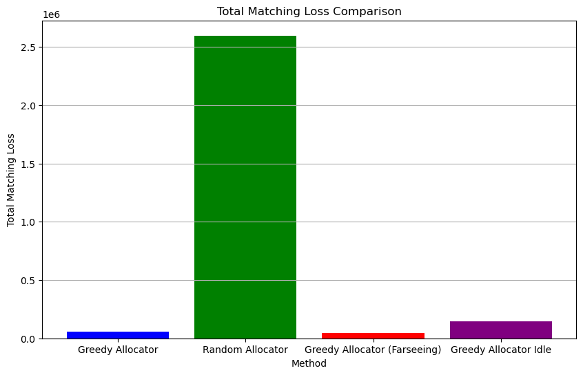
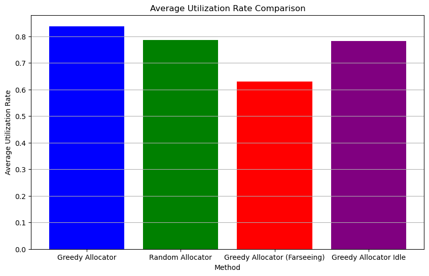
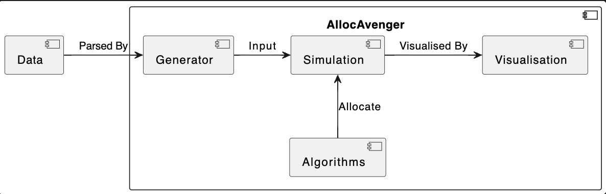
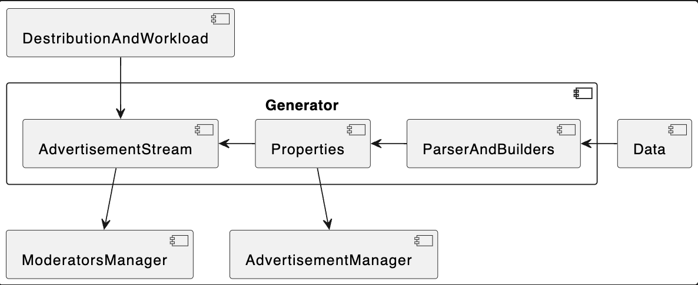
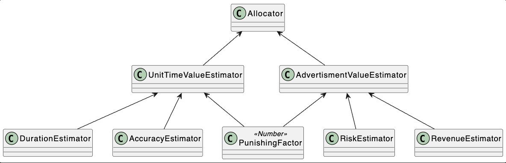

# AllocAvengers: Optimize Advertisement Moderation

Welcome to our project for the TikTok Hackathon! Our aim is to optimize advertisement moderation in a highly modularised
system, with specific focus on dynamically scoring and prioritizing social media advertisements for review, and ensuring
these reviews are matched with the best-fitting moderator.

  
   

## Background

Digital platforms like TikTok rely heavily on advertisement reviews to ensure safe and appropriate content delivery. The
aim of our project is to:

- Prioritize ad review processes based on the value and risk of the advertisements.
- Assign the most suitable moderator for a particular ad review, considering factors such as language fit and accuracy
  of moderation.

## Features
### Functional Features:

An array of Algorithms that allocate advertisement to moderators in run time by estimating their values.

Simulate advertisement arriving at different patterns (peak hours, uniform distribution etc).

Simulate advertisement and moderators by analysising the distribution pattern of properties in the data input to generate "virtual" advertisement/moderator objects. 

And of course, we also support sampling advertisement/moderator objects from the real advertisement/moderator inputs

A Simulator that combines all the components above to produce analysis of the behaviors of each algorithm for each particular input conditions.

A Visualization component and help with the analysis of the result of simulation.

### Non-Fuctional Features:
Extensibility: 

Our model can esily extends for adding more fields to the data in the excel. This is done by building a "properties" component which is a map of headings to values.

Our simulation can also easily extends for other value estimation and advertisement to moderator pairing, as long as they fulfill our interface.

Robuestness: we did extensive testing to ensure the robustness of our porject.

## Project Structure
### Overall Architecture:

Generator is repsonsible for producing the data for the simulation. It can either read from the raw data or generate synthetic data.

Algorithms is responsible for estimating the value of the advertisement and the performance of the moderators, and hence determine the allocation of the advertisements to the moderators.

Simulator is responsible for simulating the allocation of the advertisements to the moderators and the performance of the moderators, and gather the data on the total loss and utilisation rate for each algorithm and inputs combination.

Visualizer is responsible for visualizing the data gathered by the simulator.

### Generator:

Parsers and builders are responsible for producing the "Properties" component for the simulation, either by reading from the raw data or by generating synthetic data.

Then these properties are used to generate the advertisement and moderator objects.

AdvertisementStreamBuilder will further take consideration of the distribution of the arrival pattern of advertisements and the total number of advertisement to generate the advertisement stream.

Finially Generators will output advertisement manager and moderator manager objects, which are the input for the simulator.

#### 1. `data_builders` Package:
**Components**:
- `AdvertisementProducer` and `ModeratorProducer`: Reads and synthesizes the entities from raw data.
- `AdvertisementBuilder`: Generates advertisement streams, which are structured 
  as 2D arrays where the first dimension represents time units, and the second
  dimension represents ads.
- `ModeratorBuilder`: Generates a panel of moderators.
#### 2. `managers` Package:

This package primarily manages the simulations concerning advertisements and moderators. There are two core components,
each responsible for handling data related to advertisements and moderators.

**Components**:

1. **`AdvertisementManager`**:
    - **Purpose**: Manages advertisement data flow for simulations and tracks various advertisement metrics such as
      losses and completion status.
    - **Methods**:
        - `update()`: Update the status of advertisements. This includes removing completed ads, updating losses, and
          fetching new incoming ads.
        - `getUnassignedAds()`: Returns a list of ads that have not been assigned yet.
        - `allDone()`: Checks if all the ads have been processed or not.
        - `getLoss()`: Returns the total loss accumulated from all advertisements.
        - `getLossList()`: Returns a list of losses for each advertisement.

    - **Attributes**:
        - `advertisementStream`: The stream of incoming advertisements.
        - `allAds`: A list that contains all ads.
        - `incompletedAds`: A dictionary that holds ads which are not yet completed.
        - `unAssignedAds`: A dictionary that holds ads which are not yet assigned.
        - `timeRound`: A counter indicating the current round of time.
        - `nextId`: An incrementing identifier for new ads.
        - `totalLost`: Accumulated loss from the ads.

2. **`ModeratorManager`**:
    - **Purpose**: Manages the pool of moderators and tracks metrics related to their work, such as utilization rate.
    - **Methods**:
        - `getModerators()`: Returns the list of working moderators.
        - `work()`: Updates the status of moderators' tasks and removes moderators who aren't working from the active
          list.
        - `getUtilRate()`: Returns the gross utilization rate of all moderators.
        - `getUtilRateList()`: Returns a list of individual utilization rates for each moderator.

    - **Attributes**:
        - `moderators`: The list of all moderators.
        - `workingModerators`: The list of currently working moderators.

### Algorithems:

### 3. `algorithms.estimators` Package:

Allocator classes are responsible for allocating ads to moderators. It is composed of a set of algorithms that utilise the estimators to determine the value of an ad and the performance of a moderator.

Estimators are responsible for estimating the value of an ad and the performance of a moderator. Currently, our implementation for the value of an ad is based on the expected revenue of the ad adjusted with probability of this ad bening risky, and punished with a punishing factor. The suitability of a moderator to an advertisement is based on the expected unit time value of the moderator, which is the revenue of the ad ajusted with the probability of the moderator inaccuratedly make judgement divided by the expected duration the moderator need to spend on the advertisement.

**Overview**:

The `algorithms.estimators` package is designed to provide a set of tools to evaluate various parameters like revenue,
risk, duration, and accuracy for a given ad and moderator. This package ensures the ads are evaluated in a holistic manner to maximize the potential
profit while minimizing risks.

**Components**:

- `RevenueEstimator`: Estimate the revenue of ads based on past average from the same advertiser.

- `RiskEstimator`: It gives a risk score to an ad depending on the number of times an advertiser has been punished.

- `RevenueRiskBasedValueEstimator`: Determines the estimated value of an ad by considering both the revenue and risk
  associated with it.

- `ModeratorUnitTimeValueEstimator`: Calculates the value generated by a moderator over a unit of time for a given ad.
  This is crucial to assess the performance and efficiency of moderators.

- `DurationEstimator`: Determines the estimated duration a moderator would take to handle an ad based on their past
  performance and ad's baseline screening time.

- `AccuracyEstimator`: Estimates the accuracy level of a moderator while handling an ad.

### 4.`algorithms.allocators` Package:

This package consists of various allocator classes, each of which has its own approach to assign ads to moderators. The
core aim of these allocator classes is to maximize the efficiency and effectiveness of ad allocation while minimizing
inaccuracies and losses.

**Components**:

1. **`RandomAllocator`**:
    - **Purpose**: This class randomly allocates ads to currently idle moderators without considering any optimization.
    - **Methods**:
        - `allocate(ads, mods)`: Allocates ads to moderators. It tries to match ads and moderators based on the delivery
          country. If no suitable moderator is found, the ad is rejected.
        - `getInaccuracyLoss()`: Returns the total inaccuracy loss accumulated during allocation.

2. **`GreedyAllocator`**:
    - **Purpose**: A greedy algorithm that allocates ads to moderators, always aiming to assign the most valuable ad to
      the most suitable moderator.
    - **Methods**:
        - `allocate(ads, mods)`: It assigns the most valuable ad to the most
          suitable moderator, no matter the moderator is idle or not.
        - `getInaccuracyLoss()`: Returns the total inaccuracy loss accumulated during allocation.

3. **`GreedyIdleOnlyAllocator`**:
    - **Purpose**: This allocator uses a greedy approach but only considers currently idle moderators.
    - **Methods**:
        - `allocate(ads, mods)`: Allocates the most valuable ads to the most suitable idle moderator based on the value
          estimation.
        - `getInaccuracyLoss()`: Returns the total inaccuracy loss accumulated during allocation.

4. **`ModelBasedGreedyAllocator`**:
    - **Purpose**: It allocates the most valuable advertisements to the most suitable moderator, but does not actually carry out the assignment
      unless the moderator is currently idle. This takes into account of better advertisements being fetched in the future.
      Nevertheless, when allocating the less valuable advertisements, we pretend that the assignment took place, so as to
      discourage less valuable advertisements from overcrowding excellent moderators.
    - **Methods**:
        - `allocate(ads, mods)`: Allocates ads based on their value to the most suitable moderator. The allocation
          considers the ad's value, the moderator's current tasks, and possible future tasks.
        - `getInaccuracyLoss()`: Returns the total inaccuracy loss accumulated during allocation.

## How to Run

To run the setup script, run the file `setup.py`.

To run the simulation, run the file `test.py`. You may specify flags:

- `-d` for distribution of advertisements. Use `even` for uniform distribution of advertisements throughout the day, and use `uneven` for non-uniform distribution. The default is `even`.
- `-v` for volume, which controls the total number of advertisements. This should be a float value between around 0.5 to 3. The default is 1.
- `-p` for punishment factor, which controls the loss induced when a moderator erroneously pass an potentially harmful advertisement. This should be a positive float number. The default is 2.
- `-s` for type of data source. Use `raw` for the given data set, and use `synthetic` for artificially created data following the same patterns as the given data set. The default is `raw`.
- `-a` for allocation algorithms. Options include `random`, `greedy_idle`, `greedy` and `greedy_farseeing`. The last corresponds to ModelBasedGreedyAllocator above. Refer to the above for more details on allocators. The default is `greedy`.
- `-f` for file name. You may specify the export file name with this flag. The default file name simply lists the parameters above.

## Project Result

### TLDR: 
**Our greedy-based algorithm achieved SOTA in all rubrics include matching_loss and utilization rate.**  

Please refer to `analysis.ipynb` for experiments details and detialed analysis of the different algorithms.

## Future Scope

Our next steps include:

- Deploying more advanced ads allocation algorithm.
- More comprehensive experi

## Team

**Junwu:** A mathematics and computer science student interested in machine learning and algorithms.

**Ziwen:** A hacker keen on exploring new things.

**Yiwen:** Second year computer science student second majored in mathematics.

**Zebang:** A second year student majored in Data Science & Analytics.

[**Shuyao:**](https://tim-siu.github.io)  Year 2 CS major.

Feel free to explore our repository and share your feedback. Let's make the digital advertising space a safer and more
efficient platform for all users!
